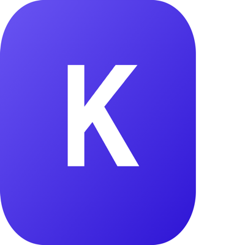

<p align="center">
  
</p>

# @kireo/mcp-server

> Kireo gives Claude Code, Cursor, and any MCP client a shared long-term memory — save decisions and gotchas as you work, recall them from any tool, and browse, edit, or delete everything in a web dashboard. Free beta.

[](https://www.npmjs.com/package/@kireo/mcp-server)

## Quickstart

1. Get an API key at <https://app.kireo.app/api-keys> (`ki_sk_…`).
2. Add this MCP server to your host. **Claude Code** example:

```jsonc
// ~/.claude/mcp.json
{
  "mcpServers": {
    "kireo": {
      "command": "npx",
      "args": ["-y", "@kireo/mcp-server"],
      "env": { "KIREO_API_KEY": "ki_sk_xxx" }
    }
  }
}
```

3. Restart the host. You now have 8 tools available to the AI:

| Tool | Purpose |
|---|---|
| `memory_save` | Persist a long-term memory |
| `memory_search` | Hybrid semantic + keyword search |
| `memory_recall` | Replay recent/important memories |
| `memory_get` | Fetch by id |
| `memory_update` | Patch fields |
| `memory_delete` | Soft/hard delete |
| `memory_list_namespaces` | Enumerate namespaces |
| `memory_health` | Probe service |

## Client setup

The server config is identical everywhere — only the file (or UI) each client reads it from differs. Use your `ki_sk_…` key from <https://app.kireo.app/api-keys>.

**Claude Code** — `~/.claude/mcp.json` (see the Quickstart block above).

**Cursor** — `~/.cursor/mcp.json` (or `<workspace>/.cursor/mcp.json` for a single repo):

```jsonc
{
  "mcpServers": {
    "kireo": {
      "command": "npx",
      "args": ["-y", "@kireo/mcp-server"],
      "env": { "KIREO_API_KEY": "ki_sk_xxx" }
    }
  }
}
```

**Cline** — open the MCP Servers panel → *Configure MCP Servers*, then add:

```json
{
  "mcpServers": {
    "kireo": {
      "command": "npx",
      "args": ["-y", "@kireo/mcp-server"],
      "env": { "KIREO_API_KEY": "ki_sk_xxx" }
    }
  }
}
```

**Claude Desktop** — `claude_desktop_config.json` (macOS: `~/Library/Application Support/Claude/`, Windows: `%APPDATA%\Claude\`):

```json
{
  "mcpServers": {
    "kireo": {
      "command": "npx",
      "args": ["-y", "@kireo/mcp-server"],
      "env": { "KIREO_API_KEY": "ki_sk_xxx" }
    }
  }
}
```

Restart the client after editing. Any other MCP-compatible host (Windsurf, Zed, Continue …) uses the same `command` / `args` / `env` triple.

## Configuration

Sources are merged in order: **CLI args > env > `~/.kireo/config.json`**.

| ENV / CLI | Default | Description |
|---|---|---|
| `KIREO_API_KEY` / `--api-key` | _required_ | Bearer token (`ki_sk_…`). |
| `KIREO_API_URL` / `--api-url` | `https://api.kireo.app` | Override for self-host. |
| `KIREO_REQUEST_TIMEOUT_MS` / `--timeout` | `60000` | Per-request timeout in ms, max `300000` (env alias: `KIREO_TIMEOUT_MS`). |
| `KIREO_RETRY_MAX_ATTEMPTS` | `3` | 5xx/429 retries (alias: `KIREO_RETRY_MAX`). |
| `KIREO_RETRY_BASE_MS` | `200` | Exponential backoff base. |
| `KIREO_TELEMETRY` | `1` | Set to `0` to disable device-id header. |
| `KIREO_LOG_LEVEL` | `info` | `debug` / `info` / `warn` / `error` / `silent`. |
| `KIREO_PROXY_URL` | _none_ | HTTP(S) proxy. |
| `KIREO_ACCEPT_LANGUAGE` | `en` | Locale for error hints. |

Logs land in `~/.kireo/logs/` on all platforms (macOS, Linux, Windows).

## Indexing local code

Index a repository's symbols (functions / classes / methods) into a
`code-<repo>` namespace so the AI can recall them via `memory_search`:

```bash
export KIREO_API_KEY=ki_sk_xxx
npx -y -p @kireo/mcp-server kireo index ./ --repo my-app
```

Indexing is incremental — only changed files are re-sent on subsequent runs.

| Flag | Default | Description |
|---|---|---|
| `--repo <name>` | directory basename | Repo name → `code-<name>` namespace. |
| `--batch-size <n>` | `100` | Symbols per upload batch (`1..100`). Lower it if a batch times out. |
| `--timeout <ms>` | `60000` | Per-request timeout (max `300000`). |
| `--api-key` / `--api-url` / `--namespace` / `--log-level` / `--no-telemetry` | — | Same as the config table above; CLI flags override env. |

Run `kireo --help` for the full usage text. `--help` and `--version` never touch
the network or the filesystem and don't require an API key. If a batch upload
times out, re-running the same command is safe: the server dedupes identical
symbols, so retries won't create duplicates.

## Host setup

- [Claude Code](./docs/host-claude-code.md)
- [Cursor](./docs/host-cursor.md)
- [Windsurf](./docs/host-windsurf.md)

## Privacy

Set `KIREO_TELEMETRY=0` to drop the `X-Device-Id` header. We never read your code; only the explicit content you pass to `memory_save` reaches the API.

## Troubleshooting

- `AUTH_INVALID_KEY` → rotate your key at <https://app.kireo.app/api-keys>.
- `QUOTA_EXCEEDED` → upgrade or wait for next billing cycle.
- Tools missing in your host → run `npx @modelcontextprotocol/inspector node $(npm root -g)/@kireo/mcp-server/bin/kireo-mcp.cjs` to verify locally.

## License

MIT
